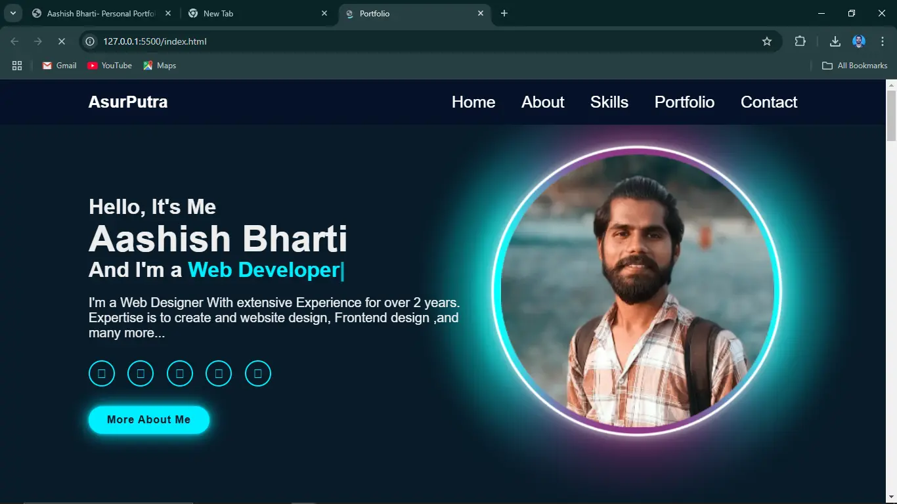

# Aashish Bharti - Personal Portfolio

Welcome to my personal portfolio! This website showcases my skills, projects, and contact information as a web developer, programmer, and data analyst.

## Table of Contents

- [About Me](#about-me)
- [Skills](#skills)
- [Projects](#projects)
- [Contact Me](#contact-me)

## About Me

Hello! I'm Aashish Bharti from Lucknow, India. I am currently pursuing my Bachelor of Computer Applications (BCA) from Babasaheb Bhimrao Ambedkar University (BBAU), Lucknow. As a final-year student, I have gained a solid foundation in web development, data analytics, and various programming languages, preparing me for a dynamic career in the tech industry. 

I have worked on several academic and personal projects, including developing dynamic websites and conducting data analysis on real-world datasets.

## Skills

- [HTML](https://www.w3schools.com/html/)
- [CSS](https://www.w3schools.com/css/)
- [JavaScript](https://www.w3schools.com/js/)
- [MS Word](https://www.tutorialspoint.com/word/index.htm)
- [MS Excel](https://www.w3schools.com/excel/)
- [Power BI](https://en.wikipedia.org/wiki/Microsoft_Power_BI)

## Projects

### 1. Campus Events Management System

A campus events management system (CEMS) helps manage events on a campus by providing software and hardware integrations, tools for planning and coordination, and event metrics.

### 2. Personal Portfolio Website

A personal portfolio website is a digital space that showcases your work, skills, and accomplishments. It's a way to share your work with potential employers, collaborators, or the press, and can be used when applying for jobs or internships.

### 3. Hidden Markov Model and Future Prediction of Stock Market

The Hidden Markov Model (HMM) is a machine learning method applied to predict stock values that estimate the sequence of hidden variables based on the sequence of observed variables and predicts the probable subsequent outcomes based on the association between the implied factors and the observed outcomes.

## Contact Me

Feel free to reach out to me through the following channels:

- Email: [bbauaashishbharti@gmail.com](mailto:bbauaashishbharti@gmail.com)
- Phone: +91 9565263445
- [LinkedIn](https://linkedin.com/in/aashish-bharti-bb5a48232)

## License

This project is licensed under the MIT License - see the [LICENSE](LICENSE) file for details.

## Acknowledgments

- Thanks to all the resources and tutorials that have helped me learn and grow as a developer.
